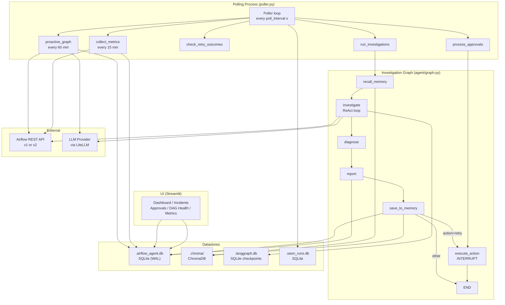
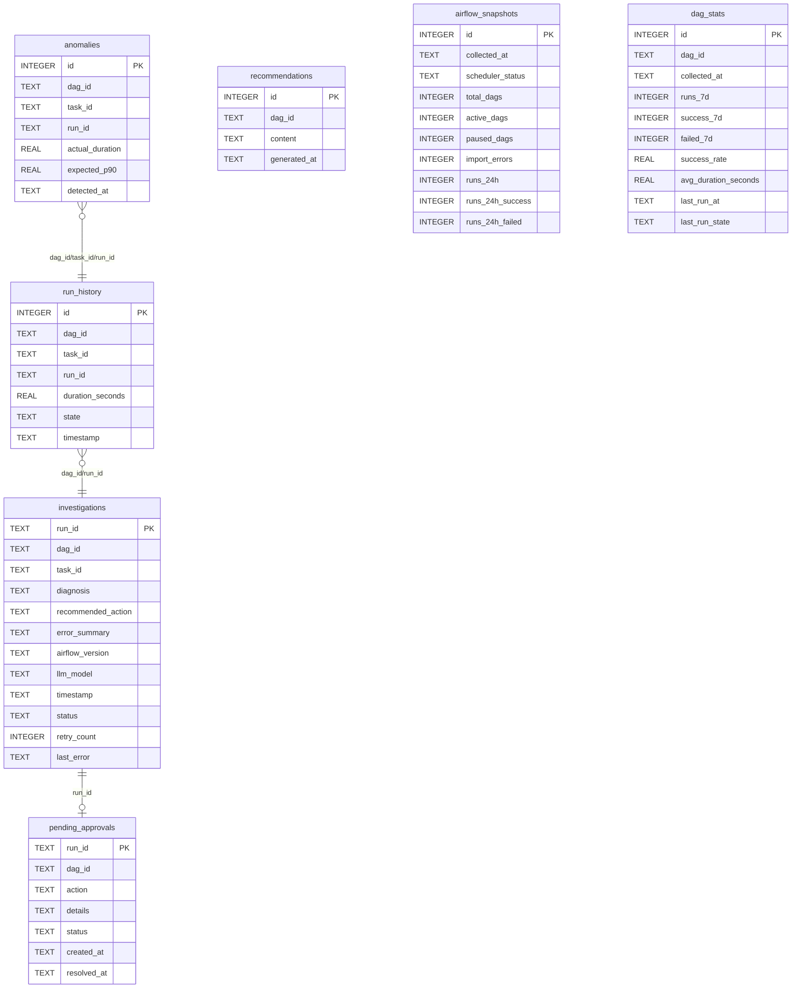

# Architecture

## Overview

The Airflow Agent is an autonomous monitoring system for Apache Airflow. It polls for failed DAG runs and DAG import errors, feeds each failure into an LLM-powered ReAct investigation loop, and surfaces diagnoses and recommended remediation actions through a Streamlit dashboard. Human operators can approve or reject retry actions before the agent executes them in Airflow.

## Tech Stack

| Layer | Technology | Notes |
|-------|-----------|-------|
| Language | Python 3.11+ | Managed with `uv` |
| Agent framework | LangGraph 0.2+ | StateGraph with SQLite checkpointing |
| LLM provider | LiteLLM 1.40+ | Provider-prefix abstraction (`groq/`, `openai/`, `ollama/`, etc.) |
| Vector memory | ChromaDB 0.5+ | Persisted at `.chroma/`; cosine similarity |
| Embeddings | sentence-transformers (local) or OpenAI-compatible API | Falls back to `all-MiniLM-L6-v2` locally |
| HTTP client | httpx | Sync; all Airflow API calls |
| State / approvals DB | SQLite (WAL mode) | `.airflow_agent.db` |
| LangGraph checkpoint DB | SQLite | `.langgraph.db` |
| Seen-runs tracker | SQLite | `.seen_runs.db` |
| UI | Streamlit 1.56+, Plotly | `ui/app.py` + 4 pages |
| Airflow 2 | apache/airflow:2.10.4, REST API v1 | Port 8080 |
| Airflow 3 | apache/airflow:3.0.1, REST API v2 | Port 8081 |
| Container runtime | Docker Compose | Two independent stacks under `docker/` |
| Linting / formatting | Ruff | `ruff check .` / `ruff format .` |
| Testing | pytest 8+ | Unit (mocked) + integration (Docker) |

## Directory Layout

```
airflow-agent/
├── poller.py              # Main entry point — polling loop and coordination
├── config.py              # All settings, loaded from .env via python-dotenv
├── Makefile               # Developer shortcuts (test, ui, poller, up2/3, down2/3)
├── pyproject.toml         # Project metadata and dependencies (uv)
│
├── agent/                 # Core agent logic
│   ├── graph.py           # LangGraph StateGraph definition (build_graph, get_graph)
│   ├── nodes.py           # Node functions: recall_memory, investigate, diagnose, report, save_to_memory, execute_action
│   ├── state.py           # AgentState TypedDict
│   ├── prompts.py         # SYSTEM_PROMPT and investigation_prompt()
│   ├── metrics.py         # Periodic Airflow health snapshot collector
│   ├── memory/
│   │   ├── schema.py      # InvestigationRecord dataclass + embed_text()
│   │   └── store.py       # InvestigationStore (ChromaDB wrapper, singleton)
│   ├── tools/
│   │   ├── airflow_client.py  # Low-level httpx calls to Airflow REST API
│   │   └── airflow_tools.py   # LangChain @tool wrappers exposed to the LLM
│   └── proactive/
│       ├── graph.py        # Proactive monitoring sub-graph
│       ├── nodes.py        # collect_dag_metrics, analyze_trends, generate_recommendations
│       └── state.py        # ProactiveState TypedDict
│
├── db/
│   └── store.py           # Central SQLite store: investigations, approvals, run_history, anomalies, metrics
│
├── ui/
│   ├── app.py             # Streamlit dashboard (main page)
│   └── pages/
│       ├── 01_incidents.py    # Investigation list with filters
│       ├── 02_approvals.py    # Human-in-the-loop approval UI
│       ├── 03_dag_health.py   # Per-DAG failure rate, duration trends, anomaly alerts
│       └── 04_metrics.py      # System health snapshot and per-DAG stats table
│
├── dags/                  # Test DAGs mounted into both Airflow containers
│   ├── customer_data_pipeline.py
│   ├── api_data_sync.py
│   ├── ml_feature_pipeline.py
│   ├── nightly_aggregation.py
│   ├── data_quality_monitor.py
│   ├── flaky_task.py
│   ├── sla_miss.py
│   └── import_error.py
│
├── docker/
│   ├── airflow2/docker-compose.yml   # Airflow 2.10.4 stack (postgres, webserver, scheduler)
│   └── airflow3/docker-compose.yml   # Airflow 3.0.1 stack (postgres, webserver, scheduler)
│
└── tests/
    ├── conftest.py            # Session fixtures: Docker Compose lifecycle, DAG trigger helpers
    ├── unit/                  # Unit tests (LLM and API mocked)
    └── integration/           # Integration tests (require Docker)
```

## Component Map



## Data Flow

**Primary investigation lifecycle:**

1. `poller.py` calls `client.list_all_failed_dag_runs()` against the Airflow REST API.
2. Any run ID not in `.seen_runs.db` is dispatched to `graph.invoke()`.
3. The graph executes node-by-node:
   - `recall_memory` — queries ChromaDB for the top-3 most similar past incidents using cosine similarity on `dag_id + task_id + error_summary + diagnosis`.
   - `investigate` — ReAct loop: the LLM (via LiteLLM) calls tools iteratively (`list_task_instances`, `get_task_log`, `get_dag_structure`, etc.) until it emits a terminal JSON diagnosis.
   - `diagnose` — parses the JSON (or regex-falls-back) into structured fields.
   - `report` — prints the incident report to stdout and persists the investigation record to SQLite.
   - `save_to_memory` — upserts the `InvestigationRecord` into ChromaDB. Routes to `execute_action` if `recommended_action == "retry"`, otherwise exits.
   - `execute_action` — LangGraph **interrupts** before this node. The poller resumes execution only after a human approves or rejects via the UI (`process_approvals` loop).
4. The run ID is marked seen in `.seen_runs.db`.

**Approval flow:**

UI writes `approved`/`rejected` to `pending_approvals` table → `process_approvals()` reads resolved rows → calls `graph.invoke(Command(resume=...))` → `execute_action` clears the task via `client.clear_task_instances()` → status updated in SQLite.

## Data Model



**Investigation status lifecycle:** `in_progress` → `completed` | `pending_approval` → `approved`/`rejected` | `retry_in_progress` → `resolved`/`stale`. Failed investigations: `pending_retry` (up to 3 attempts) → `failed_permanent`.

## External Integrations

| System | Direction | What is sent/received | When |
|--------|-----------|----------------------|------|
| Airflow REST API (v1/v2) | Outbound | Failed run list, DAG run details, task instances, task logs, import errors, health status | Every poll cycle; also on every investigation tool call |
| LLM provider (LiteLLM-routed) | Outbound | Investigation conversation messages with tool results; inbound: tool calls and final diagnosis JSON | During `investigate` and `analyze_trends` nodes |
| Local embedding model (`all-MiniLM-L6-v2`) | In-process | Text for vectorization | During `save_to_memory` and `recall_memory` |
| OpenAI-compatible embedding API (optional) | Outbound | Text for vectorization | If `EMBED_MODEL` is set |
| Ollama (optional local LLM) | Outbound (localhost) | LiteLLM proxies to `http://localhost:11434` | When `LLM_MODEL=ollama/...` or as fallback |

## Key Design Decisions

- **LiteLLM as provider abstraction**: A single `_llm_call()` function handles all LLM providers via `LLM_MODEL`'s provider-prefix string. Rate-limit handling and automatic model fallback (`LLM_FALLBACK_MODELS`) are centralised here, so no provider-specific code leaks into nodes.

- **LangGraph interrupt for human-in-the-loop**: The `execute_action` node is declared with `interrupt_before=["execute_action"]`. This means Airflow retries are never triggered automatically — the graph suspends at that edge and only resumes when the poller receives an explicit approval decision from the SQLite `pending_approvals` table.

- **Dual Airflow API support via `api_prefix`**: All Airflow API paths are constructed as `config.api_prefix + path`. Switching `AIRFLOW_API_VERSION=v1` vs `v2` in `.env` transparently redirects all calls between `/api/v1` and `/api/v2`. V1/V2 field differences (`execution_date` vs `logical_date`, different cross-DAG listing endpoints) are handled in `airflow_client.py` with a `run_date_field()` normaliser.

- **Import errors as synthetic runs**: Airflow import errors never produce DAG runs. The poller detects them via `/importErrors` and creates synthetic run IDs (`import_error__<filename>`) so they flow through the same investigation graph as real failures.

- **ChromaDB for associative memory**: Past investigation records are embedded and stored in ChromaDB. On each new investigation, the top-3 most similar past incidents are injected into the LLM prompt as context, enabling the agent to recognise recurring patterns and reference past resolutions.

- **SQLite WAL for concurrent access**: The agent DB and LangGraph checkpoint DB both use WAL journal mode, allowing the Streamlit UI process and the poller process to read/write concurrently without lock contention.

- **Anomaly detection via IQR-P90 heuristic**: Task duration anomalies are detected using `p90 + 2.5 * IQR` as the threshold (in `check_anomaly_for_run`), requiring at least 5 historical data points before firing.

- **No CI/CD pipeline**: There is no `.github/workflows/`, `.gitlab-ci.yml`, or equivalent CI configuration in the repository. All testing and deployment is manual.
